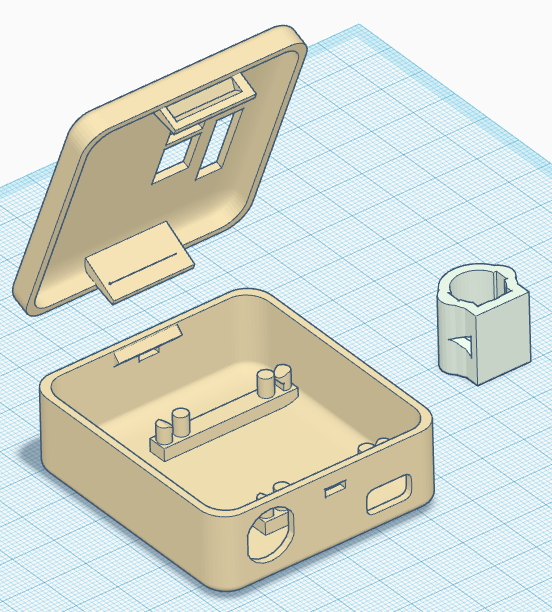
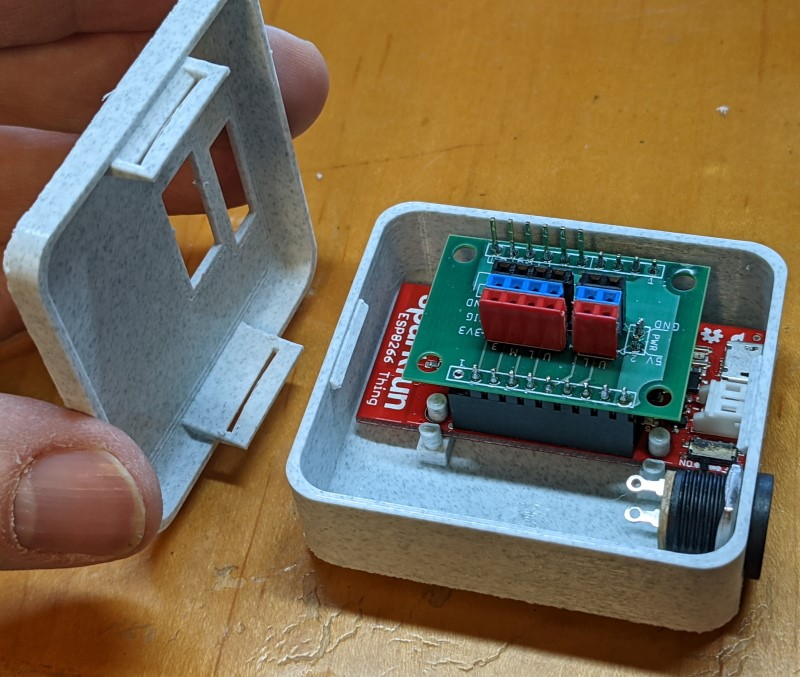

# 3D printed parts

I designed and printed many test parts for this project but ultimately used 3 of
them:

* A holder for the PIR sensors I used.
* The top and bottom case for the microcontroller and DC jack.

In this directory I've included the STL files for these parts. The [original
design was done in tinkercad](https://www.tinkercad.com/things/i8FOYjX7VH2).

