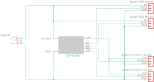

# Motion-Activated Stairwell Lights

This project uses [addressable LED
strips](https://components101.com/displays/neopixel-led-strip), two [PIR motion
sensors](https://learn.adafruit.com/pir-passive-infrared-proximity-motion-sensor),
and [a microcontroller](https://www.sparkfun.com/products/13231) to make some
motion-activated stair lighting with some cool light-up animations.

# How it works

The basic setup is:

The stairwell turns 90°, so there are two LED strips: the upper and the lower.
Similarly, there are two PIR motion sensors: the upper (looking upwards) and the
lower (looking downwards).

The LED strips and motion sensores are plugged into an ESP8266 housed in a 3D
printed box:

Within the box is the microcontroller along with a simple custom PCB that routes
the wiring:

The custom PCB by itself:

# Materials

### Core Materials

* A 5m string of **WS2812B lights** with an adhesive backing
  [[Amazon](https://www.amazon.com/gp/product/B01CDTEJBG)]   The important
  characteristics of this strip are:
  * WS2812B lights are relatively cheap but still individually addressable so
    that each LED is individually controlled.
  * 5V lights makes it easier to integrate with the microcontroller.
  * I used 60 LEDs/m density to balance smooth lighting with power usage.
    Probably 30 LEDs/m would work just about as well.
  * They have adhesive backing so I can just stick them straight to the bottom
    of the handrail.
* **PIR sensors** (2x) [[Amazon](https://www.amazon.com/gp/product/B08PVB7VHQ/)]
    The important characteristics of these are:
  * They come with connector pins already (easy to integrate) and are about the
    size I wanted.
  * They are open-collector that ground the sensor line, so they work with 5V or
    3.3V.
  * They have 3 - 5m range, which worked well for my stairwell.
* An **ESP8266 microcontroller** [[Sparkfun](https://www.sparkfun.com/products/13231)]
    I happened to have one of these microcontrollers lying around, but most
  Arduino or ESP boards should work. The important characteristics are:
  * It has at least 4 digital I/O pins.
  * It automatically handles 5V -> 3.3V conversions.
  * It's small and fairly cheap.
  * It has Wifi built-in, which is great for upcoming features I want to add.
  * It also has analog inputs that I want to use for upcoming features (a light
    sensor).

### Custom items

Some custom manufactured items:

* [A PCB](./connector-pcb) that allows simple wiring between the ESP8266 pins and the wiring to the
  LED strips and sensors.

  
  

  This was manufactured using basicpcb.com which can create this 1.5" x 1.05"
  board for only ~$2.50 each! With a min quantity of 3, that's only ~$8 for the
  board (including shipping!).

* Several [3D-printed items](./3dprint): case ([top](./3dprint/case-top.stl),
  [bottom](./3dprint/case-bottom.stl)) and [PIR sensor
  mount](./3dprint/pir-holder.stl).

  

### Miscellaneous Materials

Those are the core of the whole setup, but there's lots of additional things I
needed to actually complete the setup:

* **Colorful headers** [[Adafruit](https://www.adafruit.com/product/4160)]  
  I used these nice colorful headers so it's obvious which way to connect the
  strips since I used plain headers instead of polarized connectors. Probably I
  should have used polarized connectors, but that would probably require a PCB
  change.
* A panel-mount **DC barrel jack connector**
  [[Adafruit](https://www.adafruit.com/product/610)]
* **LED strip connectors** [[Amazon](https://www.amazon.com/gp/product/B08NX8TN8C)]
    I originally tried soldering wires to the LED strips, but changed from
  the small-gauge hookup wire to the thicker 20-gauge wire and used these
  connectors instead. I glue-gunned the connector to the bottom of the railing.
* A **5V DC power supply**. The current software draws 0.25A idle and 0.5A
  maximum current draw from the power supply (2.5W max), so this [5W power
  supply](https://smile.amazon.com/dp/B08Q38QMFD) or this [10W power
  supply](https://smile.amazon.com/dp/B0863J9RLW) should work fine and provide
  plenty of buffer.  I'm currently using [a generic
  supply](https://www.amazon.com/gp/product/B078LSVVTB) for development.
* **20 AWG solid-core hookup wire** to connect the LEDs
  [[Amazon](https://www.amazon.com/gp/product/B083DNGSPV)]   The LEDs can use
  a surprising amount of power (up to 90W for the whole strip!!), and really
  thin-guage wire may melt. The program I have runs the LEDs only at very dim
  settings, so we're not maximing out the power draw and the 20 gauge wire
  should be sufficient.
* **22 AWG hookup wire** to connect the motion sensors
  [[Amazon](https://www.amazon.com/gp/product/B088KQFHV7)]   You can use the
  20 gauge wire too, but I had this thinner wire around for the low-power
  sensors.
* A **crimper and connectors**
  [[Amazon](https://www.amazon.com/gp/product/B07R1H3Z8X)] to make clean
  connections to/from the microcontroller.   I used the XH-2A connectors for
  power with short 18-AWG wire, but that was a tight fit.

# Changes I would make if I did this again

- [ ] I'd use a board-mounted DC jack instead of a panel-mounted one and modify
  the PCB to use that. That means I'd have to extend the board a bit (a few more
  $), but connecting the board to the panel-mount DC jack was a pain.
- [ ] I'd probably space out the connectors some and use polarized connectors.
- [ ] The 3D printed case could use quite a bit of tweaking to tight up the
  tolerances.
  - [x] The opening for the programming headers was shifted to the side.
    I've fixed that in the tinkercad version but not the STLs here.
  - [ ] The snaps that hold the board are too loose -- the board snaps in
    tightly but then wiggles around.
  - [ ] The top and bottom fit together too loosely.
  - [ ] I'd try to 3D print labels on the case directly, maybe even try to
    change filament colors so they look nice. If not changing colors, at least I
    could color the raised labels.

# Features I want to add to the software

- [ ] Add wifi control and save setting to EEPROM
  - [ ] On initial boot (or when it cannot connect to wifi), start an access
    point and webserver and allow configuring the board with wifi creds.
  - [ ] When connected to wifi, allow configuring the length of each LED string
    rather than having that hard-coded.
  - [ ] Track history of when the lights were triggered and provided via the web
    server so I can be sure it's not triggering spuriously all night long.
  - [ ] Fun: Add LED test mode where a slider control turns on a single LED and
    you can watch it slide back and forth.
  - [ ] Control the "on" color of the lights via the web server. Can
    bright/dim/colorize the lights this way, but watch out! Making the LEDs too
    bright might draw too much power.
- [ ] Add [a light sensor](https://www.sparkfun.com/products/8688) to disable
  the lights when it's already bright. The connection is easy and the connector
  board already planned for this, but picking thresholds is hard. I want the web
  server up and running first.
- [ ] Maybe add a middle motion sensor that looks at the landing. Right now the
  landing is not visible from either the upper or lower sensors, but it's not a
  problem.
