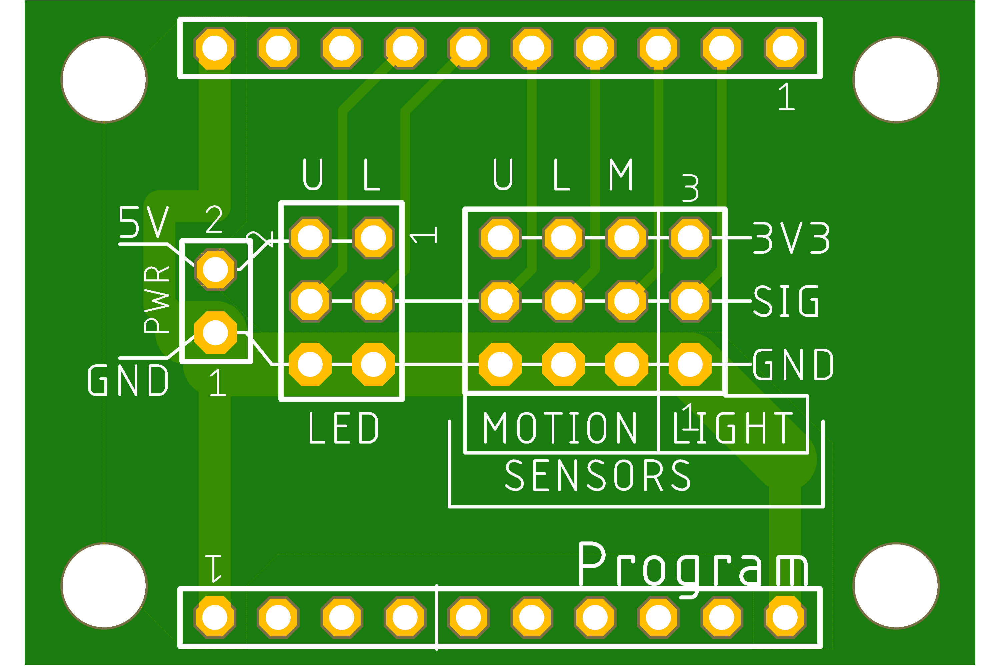
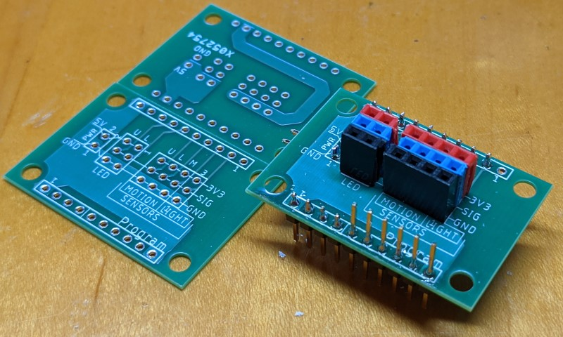

# Connector PCB

This PCB was designed to plug into a [SparkFun ESP8266
Thing](https://www.sparkfun.com/products/13231).

It was designed in the [free version of Autodesk's Eagle
CAD](https://www.autodesk.com/products/eagle/free-download).

I had this manufactured by basicpcb.com which was very cheap and fast: it cost
about $15 since I paid an extra $8 for quick shipping and I received the board
in 8 calendar days.

Included is the original [stairwell.brd](./stairwell.brd) file, but I've also
included the [gerber zip file](./stairwell_2021-02-15.zip) that can be directly
uploaded to basicpcb.

The board dimensions are 1.5" x 1.05".

Here's the file to layer mapping:

file                   | layer
-----------------------|-------------------
copper_bottom.gbr      | Bottom Copper
copper_top.gbr         | Top Copper
drill_1_16.xln         | NC Drill
gerber_job.gbrjob      | Drawing/Other
profile.gbr            | Drawing/Other
silkscreen_bottom.gbr  | Bottom Silkscreen
silkscreen_top.gbr     | Top Silkscreen
soldermask_bottom.gbr  | Bottom Soldermask
soldermask_top.gbr     | Top Soldermask
solderpaste_bottom.gbr | Bottom Solderpaste
solderpaste_top.gbr    | Top Solderpaste
